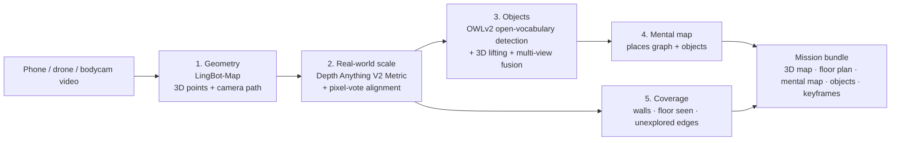
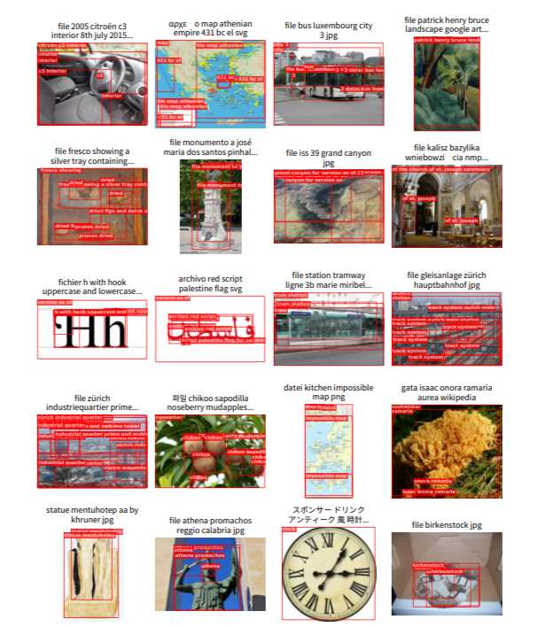
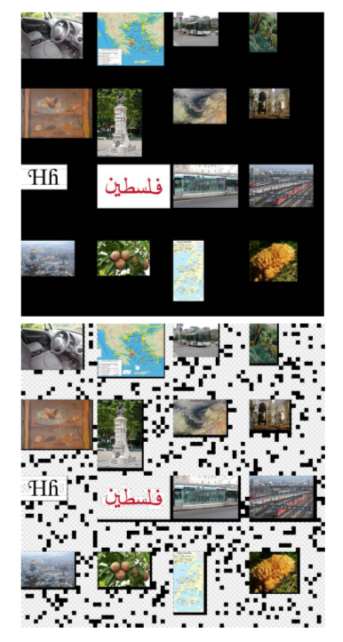
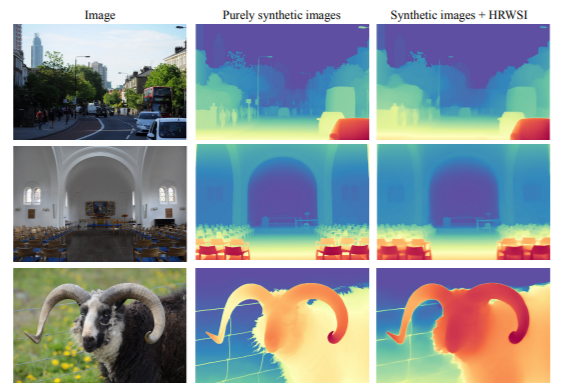
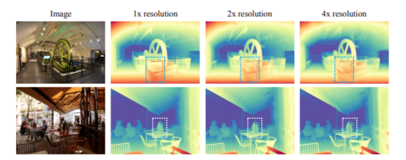

# Sanjaya

**One ordinary camera. A 3D mental map of any space, before anyone walks in.**

Sanjaya turns the camera already in your pocket, or on a drone or bodycam, into a measured
3D map of a building, tunnel or disaster site. It names what it sees (doors, stairs,
people, exits, hazards), keeps a compact *mental map* that a person or a robot can reason
with, and shows exactly **where the map ends**: the places nobody has checked yet.

> *Sanjaya*, in the Mahabharata, was given divine sight to see the whole battlefield from
> afar and describe it to those who could not. That is the job of this project: give the
> people outside a clear picture of the space inside.

| | |
|---|---|
| **Engine (live demo)** | [huggingface.co/spaces/netha01/sanjaya-engine](https://huggingface.co/spaces/netha01/sanjaya-engine) |
| **Web app** | *deployment link added at submission* |
| **Status** | Working research prototype · open source · Apache-2.0 |

---

## Why this matters

In an emergency, the most dangerous moment is the first entry into an unknown space,
and it happens with the least information.

- **Floor plans are missing, outdated or wrong**, and after a collapse, fire or blast they
  no longer describe reality.
- **GPS stops at the door.** Concrete, steel and underground spaces block satellite
  positioning and often radio.
- **Footage is reviewed afterwards**, frame by frame. Video is not measured, not
  searchable and not shared as a map.
- **Existing 3D mapping needs special hardware** (LiDAR scanners, depth cameras, specific
  drones) that is expensive, heavy and rarely where it is needed.

Sanjaya needs none of that. A 20-30 second walk-through with an ordinary phone is enough.

---

## Where it makes a difference

### 1. Knowing a building before entering it
**Who:** rescue teams, police and security units, fire services.
A scout or a small drone moves through the first rooms. Within minutes the team outside
has a measured layout: rooms, doors, stairs and exits, the distance to each, and the
**areas that have not been checked**. Teams plan the entry on facts instead of guesses.

### 2. Collapsed buildings, landslides and tunnel rescue
**Who:** NDRF, SDRF, fire and rescue services, mine rescue.
When a structure fails, the inside no longer matches any drawing. A camera on a pole, a
crawler robot or a small drone maps the void. Rescuers get distances ("2.4 m to the
opening"), a record of which spaces have been searched, and where unexplored gaps remain.

### 3. Fire and smoke response
**Who:** fire services.
A pre-incident walk-through of a large building (mall, hospital, hostel) becomes a
measured map with exits, stairs and fire extinguishers marked. It can be stored and
pulled up on the way to a call.

### 4. Tunnels, underground spaces and ship interiors
**Who:** border security, mining, coast guard and naval boarding teams.
Narrow, metal or underground spaces where GPS and radio fail. One camera produces the
length, branches and layout of the space, and the map can travel back over a weak link
because the mental map is kilobytes, not gigabytes.

### 5. A map robots can use
**Who:** robotics teams building drones, legged robots and humanoids.
Robots need a map they can plan on, not just a picture. Sanjaya's mental map is a small
graph of places, connections and objects in one metric coordinate frame (Y up, metres),
ready for path planning and for a robot to know "the door is 3 m ahead, on the right".

### 6. Inspection and change over time
**Who:** facility managers, infrastructure and site-safety teams.
Walk the same route on different days and compare: a new object, a blocked exit, a moved
barrier. *(Change detection is on the roadmap; the data format already supports it.)*

---

## How it helps in a critical situation

| Need in the field | What Sanjaya gives |
|---|---|
| Speed | A usable map in minutes from a 20-30 s clip, not hours of post-processing |
| No special equipment | Any phone, bodycam or drone camera. No LiDAR, no GPS |
| Real distances | Real-world scale (metres) estimated automatically, with a quality score |
| Know what is there | Doors, stairs, people, exits, extinguishers and anything you name in plain words, each pinned in 3D |
| Know what is *not* known | Unexplored edges marked on the floor plan, so the risk is visible |
| Weak or jammed links | The mental map is about 2-3 KB, against megabytes for the full 3D map |
| Trust | Every detection comes with its confidence and the photo it came from; people confirm, the system suggests |
| Hand-off to machines | One coordinate frame and a documented bundle robots and other software can read |

**Responsible use:** Sanjaya is for situational awareness, rescue and inspection. It maps and
describes spaces; it is **not** a targeting system. A person stays in the loop for every
decision. See [RESPONSIBLE_USE.md](RESPONSIBLE_USE.md).

---

## How it works



| Stage | Built on | What Sanjaya adds |
|---|---|---|
| 1. Geometry | **LingBot-Map** streaming 3D reconstruction (Robbyant, 2026) | Robust frame sampling, one clean coordinate frame (origin = first camera, Y up) |
| 2. Scale | **Depth Anything V2 Metric** (2024) | Pixel-by-pixel vote between the two models for one global scale, plus a reliability score |
| 3. Objects | **OWLv2** open-vocabulary detector (Google, 2023) | Lifting each detection into 3D from the per-pixel map, and merging repeat sightings across views (ConceptGraphs idea) |
| 4. Mental map | Idea from **Hydra** 3D scene graphs (MIT SPARK Lab) | Places every ~0.75 m along the path, shortcuts where paths meet, objects attached, "returned to start" detection |
| 5. Coverage | Classic frontier exploration (Yamauchi, 1997) | Top-down grid separating walls, floor actually seen, and unexplored edges, with noise and wall-gap filtering |

Each stage after geometry is guarded: if one fails, the map is still delivered with a
plain-language note on what was skipped.

---

## Examples

### Object Detection (OWLv2)




### Depth Estimation (Depth Anything V2)




---

## What you get from one video

| Output | Description |
|---|---|
| `scene.glb` | Coloured 3D point cloud with the camera path (amber) and object markers. Opens in any 3D viewer |
| `floorplan.png` | Top-down plan: walls, floor seen, unexplored edges, path, objects, 1 m scale bar |
| `mentalmap.png` / `mental_map.json` | The compact graph a person or robot reasons with |
| `manifest.json` | Stats, objects (position, size, views, confidence, evidence box), unexplored edges, settings |
| `crops/` | Best photo of every object found |
| `keyframes/` | Frames with their per-pixel 3D map (`*_xyz.f32`) for further processing |
| `trajectory.json` | Camera positions and orientations |

All 3D data shares one frame: **origin = first camera position, +Y up, −Z = initial
forward direction, units in metres** (glTF convention).

---

## Validation so far

Measured on a ray-traced synthetic corridor with known dimensions, run through the full
pipeline (stages 2-5 and all outputs):

| Check | Ground truth | Sanjaya |
|---|---|---|
| Scale recovery | 2.000× | 2.000× (synthetic depth) · 2.4996 vs 2.5 in a noisy unit test |
| Corridor size | 3.0 × 2.4 × 10.0 m | 3.0 × 2.4 × 10.0 m |
| Door position | 1.8 m right, 3.6 m ahead | 1.8 m right, 3.53 m ahead |
| Door sightings | 4 views of one door | 1 object, seen 4× |
| Loop | Walk returns to start | "returned to start" detected |
| Map size | – | mental map 2.3 KB vs full 3D map 4.8 MB |

Real-world benchmarks on public datasets and our own recorded missions are in progress and
will be published in [docs/benchmarks.md](docs/benchmarks.md). Until then we make no
real-world accuracy claims.

---

## Repository layout

```
sanjaya/
├── client/              React + Vite web app (landing page, live view, missions)
├── server/              Node.js + Express API (JWT auth, missions, Gemini, engine calls)
├── engine/
│   ├── hf_space/        Sanjaya Engine: the 5-stage pipeline (Gradio app on Hugging Face ZeroGPU)
│   │   ├── app.py       GPU stage + interface + /map API
│   │   └── sanjaya/     frames · geometry · frame · scale · objects · mental_map · render · export · engine
│   ├── app/             live-streaming worker (FastAPI, WebSocket) for the next phase
│   └── third_party/     research code we build on (git submodules)
└── docs/                architecture, real-time protocol, research notes, benchmarks
```

---

## Quick start

### Use the engine
Open the [Space](https://huggingface.co/spaces/netha01/sanjaya-engine), upload a short
walk-through video, and press **Build 3D map**.

Or call it from code:
```js
import { Client, handle_file } from "@gradio/client";

const app = await Client.connect("netha01/sanjaya-engine", { hf_token: process.env.HF_TOKEN });
const result = await app.predict("/map", {
  image_files: [],
  video_file: { video: handle_file(videoUrl) },
  scene: "Indoor",
  things: "door, staircase, person, fire extinguisher, exit sign",
  fps: 6, max_frames: 96, keyframes: 12, conf_pct: 50, min_score: 0.3,
});
// result.data → [scene.glb, floorplan, mentalmap, objects, status, mission bundle, stats]
```

### Run the engine on your own GPU
```bash
cd engine/hf_space
pip install -r requirements.txt torch gradio==5.50.0
python app.py          # needs an NVIDIA GPU (24 GB+ recommended)
```

### Run the web app locally
```bash
git clone --recursive https://github.com/<your-account>/sanjaya.git
cd sanjaya
cp server/.env.example server/.env      # add DATABASE_URL, JWT_SECRET, GEMINI_API_KEY, HF_TOKEN
cp client/.env.example client/.env
npm install
npm run dev
```
Phone cameras only work over HTTPS. See [docs/dev-https.md](docs/dev-https.md) for testing from
a real phone.

---

## Tech stack

| Layer | Technology |
|---|---|
| Frontend | React, Vite, React Router, Tailwind CSS, Axios, react-three-fiber |
| Backend | Node.js, Express, JWT, bcrypt, Zod |
| Database | Supabase PostgreSQL (Prisma) |
| AI | Google Gemini API (scene understanding, "ask the map"); key kept only on the server |
| Vision engine | LingBot-Map, Depth Anything V2 Metric, OWLv2, PyTorch, Gradio on Hugging Face ZeroGPU |
| Deployment | Vercel (client) · Render (server) · Supabase (database) · Hugging Face Spaces (engine) |

---

## Limits (honest)

- Scale from a single camera is **estimated**; every run reports a reliability score.
- Up to 128 frames per run (about 20-30 s of video) on the shared GPU.
- Glass, mirrors, blank walls, darkness, smoke and fast motion reduce quality.
- Rooms as a separate layer, live streaming and change detection are not built yet.
- This is a research prototype and is not certified for operational use.

## Roadmap

1. **Now:** video → measured 3D map, objects, mental map and coverage (this repo).
2. **Next:** live phone-to-laptop streaming; rooms layer; "what changed?" between two visits;
   ROS 2 export for robots.
3. **Later:** on-board mapping on drones and robots with no network; thermal cameras for
   smoke and darkness; several cameras merged into one map.

---

## Built on open research

- **LingBot-Map**: Chen et al., *Geometric Context Transformer for Streaming 3D Reconstruction*, 2026 · [code](https://github.com/Robbyant/lingbot-map) · [paper](https://arxiv.org/abs/2604.14141)
- **Depth Anything V2**: Yang et al., 2024 · [paper](https://arxiv.org/abs/2406.09414)
- **OWLv2**: Minderer et al., *Scaling Open-Vocabulary Object Detection*, 2023 · [paper](https://arxiv.org/abs/2306.09683)
- **Hydra**: Hughes et al., MIT SPARK Lab · [code](https://github.com/MIT-SPARK/Hydra)
- **VGGT-SLAM 2.0**: Maggio & Carlone, MIT SPARK Lab · [code](https://github.com/MIT-SPARK/VGGT-SLAM)
- **ConceptGraphs**: Gu et al., 2024 · [paper](https://arxiv.org/abs/2309.16650)
- **Frontier exploration**: Yamauchi, 1997

Torchvision-free preprocessing and the ZeroGPU loading pattern follow the community
[LingBot-Map Space by WilliamQM](https://huggingface.co/spaces/WilliamQM/craftbot-lingbot-map) (Apache-2.0).

## Contributing

This is open research and contributions are welcome: code, models, datasets, use cases
and hard questions. Read [CONTRIBUTING.md](CONTRIBUTING.md) and the
[Code of Conduct](CODE_OF_CONDUCT.md). Report security issues as described in
[SECURITY.md](SECURITY.md).

## Citation

See [CITATION.cff](CITATION.cff).

## Licence

Apache-2.0. Third-party models and code keep their own licences
(see [engine/third_party/LICENSES.md](engine/third_party/LICENSES.md)).
